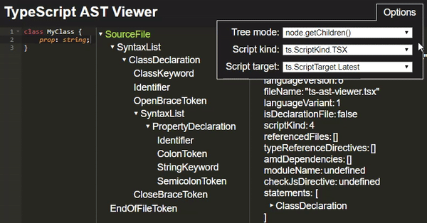

## Navigating the AST

Navigating the AST should be simple and straightforward.

Right now, the best way to explore what's implemented is to look at the autocompletion/intellisense results
or view [this report](https://github.com/dsherret/ts-simple-ast/blob/master/wrapped-nodes.md).

If you can't find something that means it's most likely not implemented and you should [open an issue](https://github.com/dsherret/ts-simple-ast/issues) on GitHub.

### General methods

Search autocomplete for methods like `.getChildren()`, `.getParent()`, `.getFirstChildBySyntaxKind(kind)`, etc...

Many exist. If you find one you would really like, then please [open an issue](https://github.com/dsherret/ts-simple-ast/issues).

### `getChildren()` and `forEachChild`

In general, you can easily navigate the tree by using methods such as `.getClasses()`, `.getClass('MyClass')`, `.getNamespaces()`, and so on, but in some cases you might want to get all the child nodes.

In the compiler API, there exists a `node.getChildren()` method and a `ts.forEachChild(node, cb)`/`node.forEachChild(cb)` function/method.

* `.getChildren()` - Returns all the children including the all the tokens (ex. `OpenBraceToken`, `SemiColonToken` etc.).
* `.forEachChild(child => {})` - Iterates all the child nodes that are properties of the node.

[](http://ts-ast-viewer.com)

In ts-simple-ast, these methods also exist and they can be used similarly to the compiler API:

```ts
const allChildren = node.getChildren();

node.forEachChild(node => {
    console.log(node.getText());
});
```

One major difference between the `.forEachChild` method in ts-simple-ast and the compiler API, is that returning a truthy value in the callback will not stop iteration. If you wish to stop iteration, then use the stop parameter function:

```ts
node.forEachChild((node, stop) => {
    console.log(node.getText());

    // stop iterating when the node is a class declaration
    if (node.getKind() === SyntaxKind.ClassDeclaration)
        stop();
});
```

### `forEachDescendant`

If you wish to iterate all the descendants, then use the `forEachDescendant` method:

```ts
node.forEachDescendant((node, stop) => console.log(node.getText()));
```

This is especially useful when writing code that implements a visitor pattern:

```ts ignore-error: 1109, setup: let sourceFiles: SourceFile[];
interface Visitor {
    visit(node: Node): void;
}

const myVisitors: Visitor[] = ...;

for (const sourceFile of sourceFiles)
    sourceFile.forEachDescendant(node => myVisitors.forEach(v => v.visit(node)));
```
