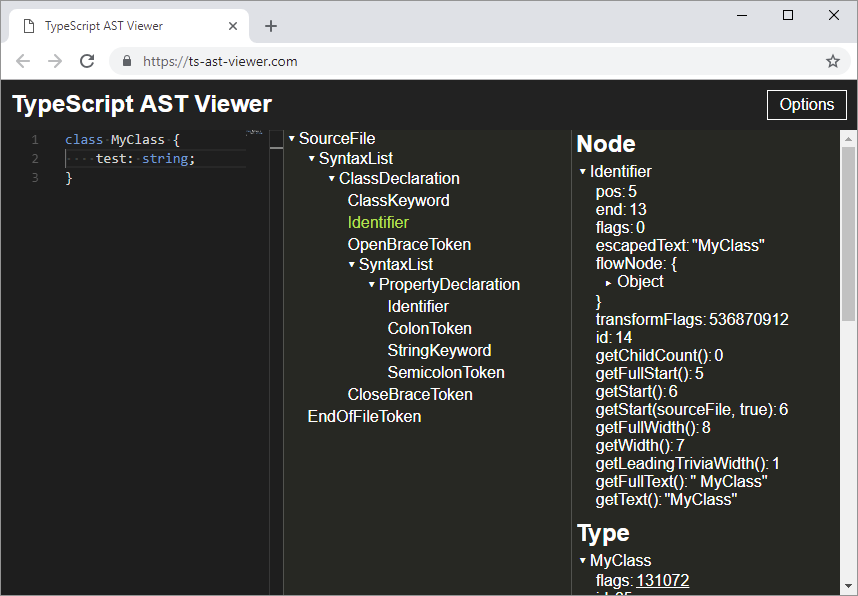
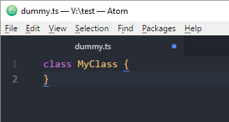
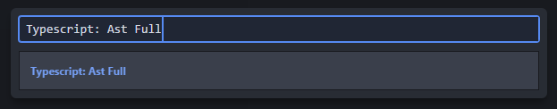
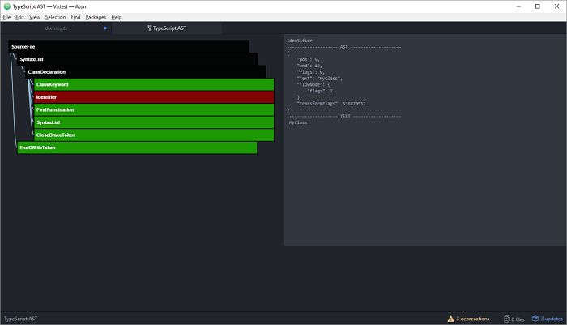

## AST Viewers

An AST viewer is a useful way to help understand the TypeScript AST for some source code.

### TypeScript AST Viewer

I've created this very basic web-based TypeScript AST viewer.

[TypeScript AST Viewer](https://dsherret.github.io/ts-ast-viewer/)

Features:

* View code on left, tree in middle, and selected node's properties on right.
* Select a node in the tree to focus on that node's properties.

I will improve and add more functionality to this in the future, but for now it will give you a good understanding of the tree.

### Atom TypeScript

This AST viewer gives an excellent view of the AST.

1. Install [Atom](https://atom.io/).
2. Install [atom-typescript](https://atom.io/packages/atom-typescript).
3. Create a new typescript file.
4. Paste in your typescript code.

    

5. Important: Ensure the current typescript document has focus.
6. Open the command palette (Windows/Linux: `ctrl+shift+p`, Mac: `cmd+shift+p`).
7. Type `TypeScript: Ast Full` and hit enter.

    

8. A new tab will appear with the AST.

    

**Bug warning:** There seems to be an issue with the AST viewer where you have to close the "TypeScript AST" tab before running the `TypeScript: Ast Full` command again.