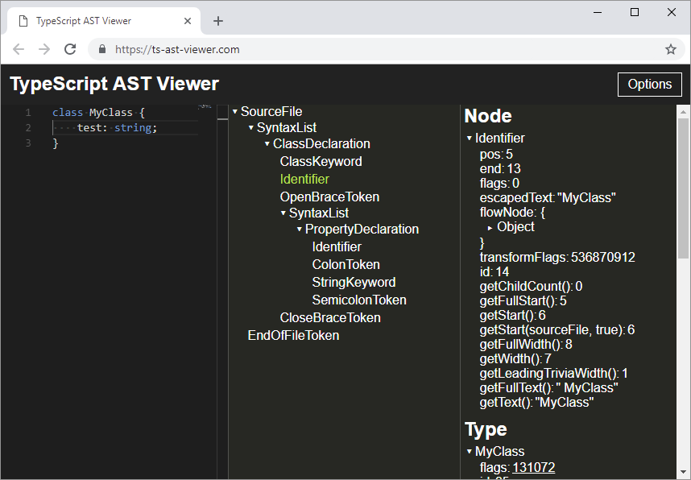

## AST Viewers

An AST viewer is a useful way to help understand the TypeScript AST for some source code.

### TypeScript AST Viewer

I've created this web-based TypeScript AST viewer that also gives information on symbols and types.

[TypeScript AST Viewer](http://ts-ast-viewer.com)

Features:

- View code on left, tree in middle, and information about selected node on right.
- View the type and symbol of the selected node.
- Toggle the tree between `node.forEachChild(...)` and `node.getChildren()`.
- Change compiler API versions.
- Use some compiler objects in the browser console.

I will improve and add more functionality to this in the future. You can help contribute to its progress [here](https://github.com/dsherret/ts-ast-viewer).
